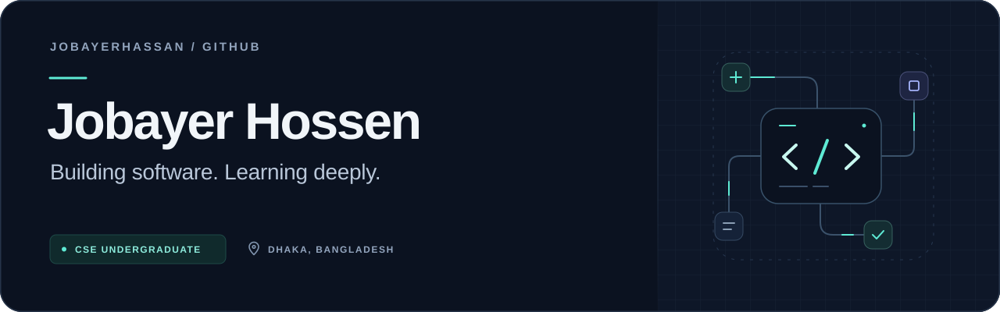
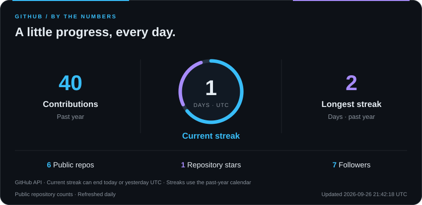
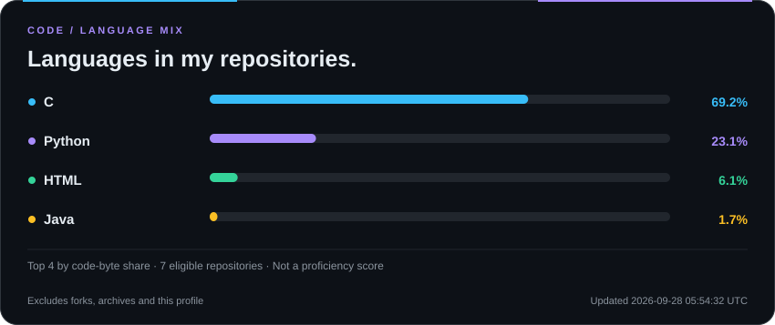

  

  

  
  &nbsp;
  
  &nbsp;
  

  <strong>Daffodil International University</strong> &nbsp; · &nbsp; Dhaka, Bangladesh 
  Practical projects. Curious thinking. Progress through code.

---

## 👨‍💻 Behind the code

Hi, I'm **Jobayer Hossen** — a Computer Science undergraduate turning classroom fundamentals into practical projects.

- 🎓 Studying **Computer Science & Engineering at DIU**.
- 🛒 Building **Smart Store**, a Java OOP project for everyday grocery shopping.
- 🧠 Exploring **Python, NLP and rubric-based answer evaluation**.
- 🧩 Practicing **data structures, graph algorithms and object-oriented design**.
- 🤝 Open to **student collaborations and useful software ideas**.
- 📬 Reach me at **[jobayerhassan788@gmail.com](mailto:jobayerhassan788@gmail.com)**.

## ⚡ Technical toolkit

<strong>Core languages</strong>

  
  &nbsp;&nbsp;
  
  &nbsp;&nbsp;
  

C &nbsp; · &nbsp; C++ &nbsp; · &nbsp; Java

<strong>Learning & exploring</strong>

  
  &nbsp;&nbsp;
  
  &nbsp;&nbsp;
  

Python &nbsp; · &nbsp; JavaScript &nbsp; · &nbsp; React

<strong>Version control & collaboration</strong>

  
  &nbsp;&nbsp;
  

Git &nbsp; · &nbsp; GitHub

## 🚀 Featured work

### 🧠 [ExamGuard AI](https://github.com/jobayerhassan/ExamGuard-AI)
**Feedback that explains the score.** A learning prototype exploring subjective-answer evaluation through text similarity, keywords and rubric-based scoring.

`Python` `Streamlit` `NLP exploration` &nbsp; [View project ↗](https://github.com/jobayerhassan/ExamGuard-AI#readme)

### 🗺️ [Delivery Route Planner](https://github.com/jobayerhassan/DeliveryRoutePlanner)
**Graph theory meets delivery planning.** A C console team project covering customers, drivers, locations and route planning. My contribution focuses on **delivery and driver management**.

`C` `BFS` `Dijkstra` `Team project` &nbsp; [View project ↗](https://github.com/jobayerhassan/DeliveryRoutePlanner#readme)

### 🛒 [Smart Store](https://github.com/jobayerhassan/Smart-Store)
**Everyday groceries, smarter planning.** A university OOP project in development, with a planned experience connecting shopping, recipes, pantry awareness and budget-conscious choices.

`Java` `OOP` `In development` &nbsp; [View project ↗](https://github.com/jobayerhassan/Smart-Store#readme)

## 📊 GitHub at a glance

  

  

## 🐍 Contributions in motion

<picture>
  <source media="(prefers-color-scheme: dark)" srcset="https://raw.githubusercontent.com/jobayerhassan/jobayerhassan/output/github-contribution-grid-snake-dark.svg">
  <source media="(prefers-color-scheme: light)" srcset="https://raw.githubusercontent.com/jobayerhassan/jobayerhassan/output/github-contribution-grid-snake.svg">
  
</picture>

Small steps, written in code. Updated daily from my GitHub activity.

---

  <strong>Have a useful idea? Let's build it together.</strong> 
  Always learning. Always making the next version better.

  
  &nbsp;
  

